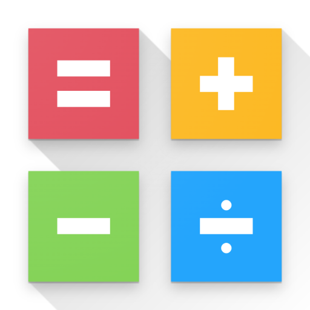

<div align="center">


# Hesap Makinesi

**A modern, dark neon calculator app for Android**


</div>

---

## Screenshots

> Dark neon UI — deep black background with cyan accent highlights.

| Calculator | About Dialog |
|:---:|:---:|
|  |  |

---

## Features

- **Live result preview** — see the result as you type, before pressing `=`
- **Full arithmetic** — addition, subtraction, multiplication, division
- **Percentage** — `%` operator with natural expression support
- **Sign toggle** — `+/-` flips the sign of the current number
- **Backspace** — delete the last character with `⌫`
- **Precise calculation** — powered by `BigDecimal` for accurate decimal math
- **Haptic feedback** — subtle vibration on every button press
- **About dialog** — tap `ℹ` in the top-right corner for app info and version
- **Fully offline** — no internet, no permissions, no data collection

---

## Tech Stack

| Component | Detail |
|---|---|
| Language | Kotlin |
| Min SDK | 24 (Android 7.0 Nougat) |
| Target SDK | 35 (Android 15) |
| Compile SDK | 35 |
| UI | XML Layouts + Material Components 3 |
| Architecture | Single Activity |
| Math Engine | `java.math.BigDecimal` |
| Build System | Gradle (Kotlin DSL) |

---

## Project Structure

```
Hesap_m/
├── app/
│   └── src/main/
│       ├── java/com/ao/calc/
│       │   └── MainActivity.kt
│       └── res/
│           ├── layout/
│           │   ├── activity_main.xml
│           │   └── dialog_about.xml
│           ├── mipmap-*/          # App icons (all densities)
│           └── values/
│               ├── colors.xml
│               ├── strings.xml
│               └── themes.xml
├── gradle/
│   ├── libs.versions.toml
│   └── wrapper/
├── build.gradle.kts
├── settings.gradle.kts
├── gradle.properties
└── privacy_policy.md
```

---

## Getting Started

### Prerequisites

- Android Studio Ladybug (2024.2.1) or newer
- JDK 11+
- Android SDK with API 35

### Build & Run

```bash
# Clone the repository
git clone https://github.com/<your-username>/Hesap_m.git

# Open in Android Studio
# File → Open → select the Hesap_m folder

# Or build via command line
./gradlew assembleDebug
```

The debug APK will be generated at:
```
app/build/outputs/apk/debug/app-debug.apk
```

---

## Design

The app uses a **dark neon** design language:

| Token | Color | Usage |
|---|---|---|
| Background | `#0A0A0F` | App background |
| Card | `#12121A` | Display card |
| Neon Cyan | `#00E5FF` | Result text, accent, `=` button |
| Neon Blue | `#2979FF` | Primary variant |
| Number buttons | `#1A1A28` | Digit keys |
| Operator buttons | `#1A2A3A` | `+` `-` `×` `÷` |
| Function buttons | `#1E1E30` | `AC` `+/-` `%` `⌫` |

---

## Permissions

This app requests **zero permissions**. It works completely offline with no network access, no storage access, and no device sensor access.

See [privacy_policy.md](privacy_policy.md) for full details.

---

## Developer

**Arif Onur Bütün**
TA4AB

---

## License

```
MIT License

Copyright (c) 2025 Arif Onur Bütün

Permission is hereby granted, free of charge, to any person obtaining a copy
of this software and associated documentation files (the "Software"), to deal
in the Software without restriction, including without limitation the rights
to use, copy, modify, merge, publish, distribute, sublicense, and/or sell
copies of the Software, and to permit persons to whom the Software is
furnished to do so, subject to the following conditions:

The above copyright notice and this permission notice shall be included in all
copies or substantial portions of the Software.

THE SOFTWARE IS PROVIDED "AS IS", WITHOUT WARRANTY OF ANY KIND, EXPRESS OR
IMPLIED, INCLUDING BUT NOT LIMITED TO THE WARRANTIES OF MERCHANTABILITY,
FITNESS FOR A PARTICULAR PURPOSE AND NONINFRINGEMENT.
```
